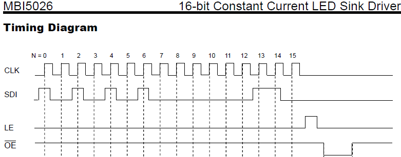
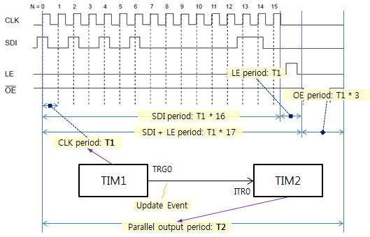
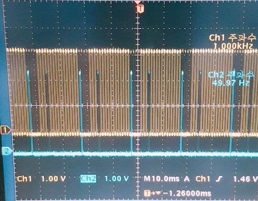
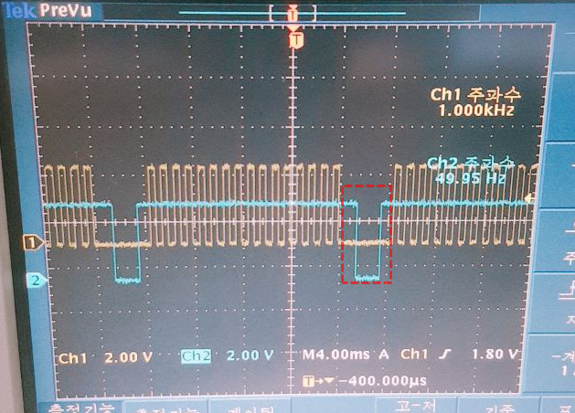
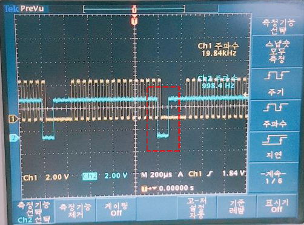

## Interfacing MBI5026 using STM32 timers with Nucleo-F401RE

### Overview
This STM32 Hal based source code is to generate several signals interfacing MBI5026 16-bit constant current LED sink driver.  
The MBI5026 is a kind of serial-in and parallel-out IC. To talk with this IC a MCU has to output signals with proper timing.  
 

### Build & Run environment
* Nucleo-F401RE
* STM32CubeMX Version 4.25.0
* Keil MDK-ARM 5.24.1

### Implementing timing diagram
The timing domain consists of CLK, SDI, LE and OE pulses. To make it simple CLK, SDI and LE pulses are grouped together with a same clock width.
The range of remain OE pulse is treated as three clock width of SDI so that total number of clocks are 20.  

There are two frequencies in this diagram:  
  - T1: data shift frequency  
  - T2: parallel output frequency (T1 * 20)

Two TIM timers are used to make these ferquencies respectively.  
A TIM1 is in charge of T1 pulse. A TIM1 triggers a Update Event to TIM2 at each 20 cycles by setting a Repetition Count (RCR) 19.  
The _Slave Mode_ of TIM2 is _Reset Mode_ that restarts the timer count then activates the PWM output channel1.

### Signal outputs
Output clock frequency is 1kHz.  
A following signal capture picture shows 16 CLK clocks for serial data input and one clock for LE(Latch Enable).  

Next picture shows CLK and OE with time sync when T1 frequency 1 kHz.

To see maximum timer performance, T1 frequency is change to 20 kHz from 1 kHz by adjusting Prescaler (PSC) value to 80-1 from 1600-1.
The CLK seems ok but with wrong timing which may be caused from S/W interrupt delay.

### Conclusion
It is easy to implement interrupt driven serial-in and parallel-out using STM32 timers.
But it works in low speed frequency.  
Dedicated Compare Output of timer and DMA data feed solution is applicable when high speed frequency is required.
 

---
  By Hill Kim
